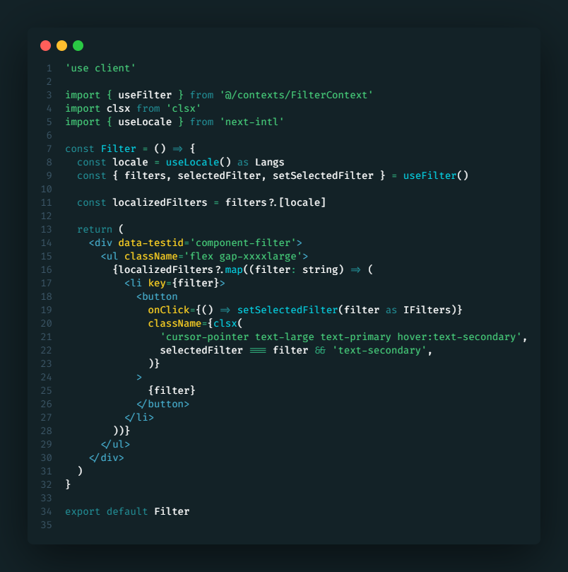

# Duete Theme

A minimalist dark theme with **green and bluish tones**, crafted for visual comfort and excellent contrast.  
Perfect for long coding sessions without straining your eyes.

Made by [Gabriel Duete](https://gabrielduete.com/)

---

## Preview

---

## Features

- **Soft dark greenish background** for reduced eye strain
- **Balanced color palette** for JSX, TypeScript, HTML, CSS, and terminal
- **Special highlighting** for strings and imports
- **High readability** for extended coding sessions

---

## Installation

1. Open **Visual Studio Code**
2. Go to `Extensions` (`Ctrl+Shift+X`)
3. Search for **Duete Theme**
4. Click **Install**
5. Go to `Preferences > Color Theme` and select **Duete Theme**
6. 🌟 Enjoy and Rate [five-stars](https://marketplace.visualstudio.com/items?itemName=GabrielDuete.duete-theme&ssr=false#review-details).

---

## License

[MIT](LICENSE)

---

**Pro Tip:** Combine Duete Theme with your favorite font ligatures (e.g., Fira Code) for an even better look!
